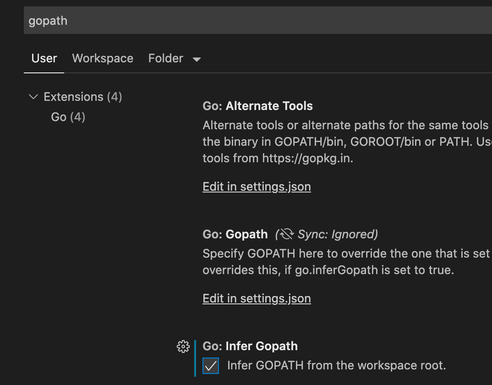

> Deadline: Tuesday 10/1/2020
> GitHub Repo Setup: [https://classroom.github.com/g/CiCW_6Vr](https://classroom.github.com/g/CiCW_6Vr)
> This assignment must be completed in **groups of 1-4 students**. 

## Introduction

In this lab you'll build a MapReduce system. You'll implement a worker process that calls application Map and Reduce functions and handles reading and writing files, and a master process that hands out tasks to workers and copes with failed workers. You'll be building something similar to the [MapReduce paper](http://research.google.com/archive/mapreduce-osdi04.pdf).

> To solve this assignment you will need to understand the MapReduce architecture and algorithm... you will need to read the paper to get the details!

## Collaboration Policy

As a team you must write all the code you hand in, except for code that we give you as part of assignments. You are not allowed to look at other group's solution, and you are not allowed to look at existing solutions to the problem. You may discuss the assignments with other groups, but you may not look at or copy each others' code. The reason for this rule is that we believe you will learn the most by designing and implementing your lab solution yourself.

> *All students* on a team are expected to contribute to the coding. When you submit your assignment you will also provide us with feedback on how evenly work was divided in your team. **Make sure that you are doing your part and not causing your teammates grief by waiting until the last minute!**

Please do not publish your code or make it available to current or future students. <tt>github.com</tt> repositories are public by default, so please don't put your code there unless you make the repository private.

## Environment Setup

> **A Note for Windows users:** This scripts used in this assignment probably <b>won't</b> work directly on Windows. If you're feeling adventurous, you can try to get them running inside [Windows Subsystem for Linux](https://docs.microsoft.com/en-us/windows/wsl/install-win10). Otherwise, you can use an Amazon VM and VS Code's Remote developer extension.

Before you start coding you need to be sure your environment is configured properly. This project has a more complicated set of files than the prior assignment, so you will need some extra steps.  Go looks for files to import into your project using the $GOPATH environment variable.  For the code to work properly, you need to set the root of your repository as part of your path. We have provided a script which will do this for your terminal, but you may also need to separately configure your IDE (VS Code).  Here are the recommended steps:

  - In VS Code, go to the *Code->Preferences->Settings* Menu
    - In the search box type `gopath`
    - Under the *Go: Infer Gopath* click the checkbox
    - Note that you can either put this in your *User settings* (affecting all VS Code projects, which we recommend) or your *Workspace settings* if you just want it to impact this workspace.
    - Once you have done this, some of the errors in the code should disappear, for example opening the `mrsequential.go` file should no longer show an import error for the `mr` package and you should be able to see the definition for a type such as `mr.KeyValue` if you hover over it.
  - When you compile code from the command line, you will still need to manually run our script to configure your gopath:
    - `source setEnv.sh`
    - Note that we provide a Makefile which will automate this process for you and run various tests.  In most cases you should just use the Makefile directly.

## Getting started

We supply you with a simple sequential mapreduce implementation in <tt>src/main/mrsequential.go</tt>. It runs the maps and reduces one at a time, in a single process. We also provide you with a couple of MapReduce applications: word-count in <tt>mrapps/wc.go</tt>, and a text indexer in <tt>mrapps/indexer.go</tt>. These programs will be compiled into shared object libraries (`.so` files) which are then loaded together with your MapReduce application.

For example, you can run word count sequentially as follows:

<pre>$ cd hw2-mapreduce-your-team-name
$ source ./setEnv.sh
$ cd src/main
$ go build -buildmode=plugin ../mrapps/wc.go
$ rm mr-out*
$ go run mrsequential.go wc.so pg*.txt
$ head mr-out-0
A 509
ABOUT 2
ACT 8
...
</pre>

<tt>mrsequential.go</tt> leaves its output in the file <tt>mr-out-0</tt>. The input is from the text files named <tt>pg-xxx.txt</tt>.

Feel free to borrow code from <tt>mrsequential.go</tt>. You should also have a look at <tt>mrapps/wc.go</tt> to see what MapReduce application code looks like.

> **Important:** The first time you run `setEnv.sh` it will update a github configuration file (`.github/workflows/classroom.yml`).  You *must commit this updated file to your repository and include it with your submission!*

## Your Job

Your job is to implement a distributed MapReduce, consisting of two programs, the master and the worker. There will be just one master process, and one or more worker processes executing in parallel. In a real system the workers would run on a bunch of different machines, but for this lab you'll run them all on a single machine. The workers will talk to the master via RPC. Each worker process will ask the master for a task, read the task's input from one or more files, execute the task, and write the task's output to one or more files. The master should notice if a worker hasn't completed its task in a reasonable amount of time (for this lab, use ten seconds), and give the same task to a different worker.

We have given you a little code to start you off. The "main" routines for the master and worker are in <tt>main/mrmaster.go</tt> and <tt>main/mrworker.go</tt>; don't change these files. You should put your implementation in <tt>mr/master.go</tt>, <tt>mr/worker.go</tt>, and <tt>mr/rpc.go</tt>.

To get full credit, your code will need to do the following:
 - The master should distribute map tasks to the workers (Hint: have workers ask the master for tasks)
 - Workers should process tasks and produce intermediate output files (Hint: be careful about how you write these files to ensure that all data with the same key will go to the same reduce task)
 - The master should distribute reduce tasks that merge the intermediate files to produce the final outputs
 - The master should detect the failure of map or reduce tasks and reassign them if necessary

We strongly recommend you carefully read through the full list of hints below (in addition to the MapReduce paper) for more guidance.

---

Here's how to run your code on the word-count MapReduce application. First, make sure the word-count plugin is freshly built:

<pre>$ go build -buildmode=plugin ../mrapps/wc.go
</pre>

In the <tt>main</tt> directory, run the master.

<pre>$ rm mr-out*
$ go run mrmaster.go pg-*.txt
</pre>

The <tt>pg-*.txt</tt> arguments to <tt>mrmaster.go</tt> are the input files; each file corresponds to one "split", and is the input to one Map task.

In one or more other windows, run some workers:

<pre>$ go run mrworker.go wc.so
</pre>

When the workers and master have finished, look at the output in <tt>mr-out-*</tt>. When you've completed the lab, the sorted union of the output files should match the sequential output, like this:

<pre>$ cat mr-out-* | sort | more
A 509
ABOUT 2
ACT 8
...
</pre>

We supply you with a test script in <tt>main/test-mr.sh</tt>. The tests check that the <tt>wc</tt> and <tt>indexer</tt> MapReduce applications produce the correct output when given the <tt>pg-xxx.txt</tt> files as input. The tests also check that your implementation runs the Map and Reduce tasks in parallel, and that your implementation recovers from workers that crash while running tasks.

If you run the test script now, it will hang because the master never finishes:

<pre>$ cd mapreduce
$ make
*** Starting wc test.
</pre>

You can change <tt>ret := false</tt> to true in the Done function in <tt>mr/master.go</tt> so that the master exits immediately. Then:

<pre>$ make
*** Starting wc test.
sort: No such file or directory
cmp: EOF on mr-wc-all
--- wc output is not the same as mr-correct-wc.txt
--- wc test: FAIL
$
</pre>

The test script expects to see output in files named <tt>mr-out-X</tt>, one for each reduce task. The empty implementations of <tt>mr/master.go</tt> and <tt>mr/worker.go</tt> don't produce those files (or do much of anything else), so the test fails.

When you've finished, the test script output should look like this:

<pre>$ make
*** Starting wc test.
--- wc test: PASS
*** Starting indexer test.
--- indexer test: PASS
*** Starting map parallelism test.
--- map parallelism test: PASS
*** Starting reduce parallelism test.
--- reduce parallelism test: PASS
*** Starting crash test.
--- crash test: PASS
*** PASSED ALL TESTS
$
</pre>

You'll also see some errors from the Go RPC package that look like

<pre>2019/12/16 13:27:09 rpc.Register: method "Done" has 1 input parameters; needs exactly three
</pre>

Ignore these messages.

A few rules:

*   The map phase should divide the intermediate keys into buckets for <tt>nReduce</tt> reduce tasks, where <tt>nReduce</tt> is the argument that <tt>main/mrmaster.go</tt> passes to <tt>MakeMaster()</tt>.
*   The worker implementation should put the output of the X'th reduce task in the file <tt>mr-out-X</tt>.
*   A <tt>mr-out-X</tt> file should contain one line per Reduce function output. The line should be generated with the Go <tt>"%v %v"</tt> format, called with the key and value. Have a look in <tt>main/mrsequential.go</tt> for the line commented "this is the correct format". The test script will fail if your implementation deviates too much from this format.
*   You can modify <tt>mr/worker.go</tt>, <tt>mr/master.go</tt>, and <tt>mr/rpc.go</tt>. You can temporarily modify other files for testing, but make sure your code works with the original versions; we'll test with the original versions.
*   The worker should put intermediate Map output in files in the current directory, where your worker can later read them as input to Reduce tasks.
*   <tt>main/mrmaster.go</tt> expects <tt>mr/master.go</tt> to implement a <tt>Done()</tt> method that returns true when the MapReduce job is completely finished; at that point, <tt>mrmaster.go</tt> will exit.
*   When the job is completely finished, the worker processes should exit. **Important:** the testing scripts may fail if any of the workers exit before all tasks have been completed -- make sure that *all* tasks are done before *any* worker exits. A simple way to implement this is to have workers keep checking in with the master, and make sure that the master exits only once all tasks are complete. Then you can use the return value from <tt>call()</tt>: if the worker fails to contact the master, it can assume that the master has exited because the job is done, and so the worker can terminate too. Depending on your design, you might also find it helpful to have a "please exit" pseudo-task that the master can give to workers only once all other tasks have been finished.

## Hints

> Make sure your code doesn’t have any extraneous outputs. We have provided an output function `DPrintf` on <tt>src/mr/common.go</tt> which you can use for your debug output while developing. Then make sure to set `debugEnabled = false` when submitting for grading to disable all prints.  

*   One way to get started is to modify <tt>mr/worker.go</tt>'s <tt>Worker()</tt> to send an RPC to the master asking for a task. Then modify the master to respond with the file name of an as-yet-unstarted map task. Then modify the worker to read that file and call the application Map function, as in <tt>mrsequential.go</tt>.
*   The application Map and Reduce functions are loaded at run-time using the Go plugin package, from files whose names end in <tt>.so</tt>.
*   If you change anything in the <tt>mr/</tt> directory, you will probably have to re-build any MapReduce plugins you use, with something like <tt>go build -buildmode=plugin ../mrapps/wc.go</tt>
*   This lab relies on the workers sharing a file system. That's straightforward when all workers run on the same machine, but would require a global filesystem like GFS if the workers ran on different machines.
*   A reasonable naming convention for intermediate files is <tt>mr-X-Y</tt>, where X is the Map task number, and Y is the reduce task number.
*   The worker's map task code will need a way to store intermediate key/value pairs in files in a way that can be correctly read back during reduce tasks. One possibility is to use Go's <tt>encoding/json</tt> package. To write key/value pairs to a JSON file:

    <pre>  enc := json.NewEncoder(file)
      for _, kv := ... {
        err := enc.Encode(&kv)
    </pre>

    and to read such a file back:

    <pre>  dec := json.NewDecoder(file)
      for {
        var kv KeyValue
        if err := dec.Decode(&kv); err != nil {
          break
        }
        kva = append(kva, kv)
      }
    </pre>

*   The map part of your worker can use the <tt>ihash(key)</tt> function (in <tt>worker.go</tt>) to pick the reduce task for a given key.
*   You can copy some code from <tt>mrsequential.go</tt> for reading Map input files, for sorting intermedate key/value pairs between the Map and Reduce, and for storing Reduce output in files.
*   The master, as an RPC server, will be concurrent; don't forget to lock shared data.
*   Use Go's race detector, with <tt>go build -race</tt> and <tt>go run -race</tt>. <tt>main/test-mr.sh</tt> has a comment that shows you how to enable the race detector for the tests.
*   Workers will sometimes need to wait, e.g. reduces can't start until the last map has finished. One possibility is for workers to periodically ask the master for work, sleeping with <tt>time.Sleep()</tt> between each request. Another possibility is for the relevant RPC handler in the master to have a loop that waits, either with <tt>time.Sleep()</tt> or <tt>sync.Cond</tt>. Go runs the handler for each RPC in its own thread, so the fact that one handler is waiting won't prevent the master from processing other RPCs.
*   The master can't reliably distinguish between crashed workers, workers that are alive but have stalled for some reason, and workers that are executing but too slowly to be useful. The best you can do is have the master wait for some amount of time, and then give up and re-issue the task to a different worker. For this lab, have the master wait for <tt>ten</tt> seconds; after that the master should assume the worker has died (of course, it might not have).
*   To test crash recovery, you can use the <tt>mrapps/crash.go</tt> application plugin. It randomly exits in the Map and Reduce functions.
*   To ensure that nobody observes partially written files in the presence of crashes, the MapReduce paper mentions the trick of using a temporary file and atomically renaming it once it is completely written. You can use <tt>ioutil.TempFile</tt> to create a temporary file and <tt>os.Rename</tt> to atomically rename it.
*   <tt>test-mr.sh</tt> runs all the processes in the sub-directory <tt>mr-tmp</tt>, so if something goes wrong and you want to look at intermediate or output files, look there.

## Submission and Grading

Push your finalized code to github, but 

  1. Make sure your code doesn't have any extraneous outputs and matches the requirements above. Remember to remove any intermediate files and the compiled binary file. You can modify [.gitignore](https://git-scm.com/docs/gitignore) file to intentionally ignore these files. Your repository will be graded in part on its cleanliness. 
  2. Commit and Push your code, check the github interface to be sure it is there
  3. (**IMPORTANT**) Go to the Issues page of your repository and create a new issue titled `MapReduce Submission` with the following information:
  * Your team name and members
  * Which team members contributed which parts
  * If any aspects of your code are incomplete or not working, you should explain which parts have a problem.
  * Then tag the graders in the issue using their github usernames (`@HuadongHu and @freebyron`).

**UPDATED Late Policy:** Assignments submitted after the deadline but before 11:59PM on October 8th will only lose 10 points total. Late submissions after that will lose an additional 5 points per 24 hour period.  If you make any commits to your repository after the deadline, the submission will be considered late unless you have already coordinated this with the instructors. **If you submit more than 2 weeks late you must contact the instructor for approval!**

> **Acknowledgments:** This assignment is adapted from the MIT 6.824 Distributed Systems course, which was developed by Robert Morris, Frans Kaashoek, and Nickolai Zeldovich.